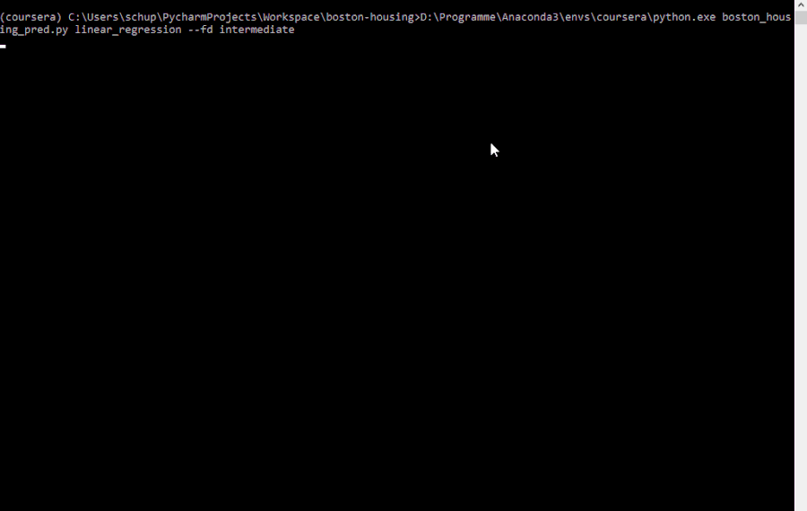

# Boston Housing Prediction
> Predict Housing prices in boston with different Models. This repository is mainly for learning purpose and NOT for comercial-use.   
  
[![License][license-badge]][license-url]
[![Codacy Badge][codacy-badge]][codacy-url]
[![Build Status][travis-badge]][travis-url]
![Lines of Code][lines-codes-badge]  
Boston Housing Prediction is a python script that can predict the housing prices in boston with different models, the user can choose from.  



## Installation
You need to have `python >= 3.5` installed.

To install the the script do([Press to view PYPI page](https://pypi.org/project/boston-housing-prediction/)):  

```sh
$ pip install boston_housing_prediction
```
For older versions:  
Alternatively download the latest release of `boston-housing`. Open the zip and in the `code` or `boston_housing_prediction` folder(folders have different names in different versions) you can see the script and its libaries.

## Usage example

You can run the programm with:
```sh
$ python -m boston_housing_prediction model_name
```  
To see the help(for extra options) do:
```sh
$ python -m boston_housing_prediction -h
```  

<!--__For more examples and usage, please refer to the [Wiki][wiki]._-->

## Release History
*   1.0.0
    *   added Neural Network with pytorch
    
*   0.3.0
    *   added normal_equation

*   0.2.3
    *   choosing alpha is now possible
    *   you can leave inputs empty and it will choose default values
    *   bugfixes like #25 and more
    *   uploaded pre-trained models that can be downloaded

*   0.2.2
    *   fix negative input for training of model #24
    *   fix negative output of predictions #24
    *   optimized folder structure for PYPI #13
    *   optimized some code.(comments, input)
    *   documentation: changes in PYPI, coments in code 
    
*   0.2.1
    *   add normalization for data
    
*   0.2.0
    *   release of polynomial_model
    
*   0.1.2
    *   bugfixes #4, #5
    *   serperated code in different files for more clarity. See code folder

*   0.1.1
    *   added functionality to load models without training
    *   plots are now outsourced and handled by a different kernel
    *   dataset gets automatically downloaded when missing
    *   v_data shows 4 different plots to describe the data(previously 2).
    
*   0.1.0  
    *   The first proper release
    *   Realese of readme (Thanks @dbader)
       
*   0.0.1  
    *   Work in progress

## Roadmap (planned updates)

*   Add more models:
    
    *   linear regression :heavy_check_mark:
    *   polynomial_regression :heavy_check_mark:
    *   normal equation :heavy_check_mark:
    *   neural network :heavy_check_mark:

*   Upload pre-trained models :heavy_check_mark::

## Meta

<!--Your Name – [@YourTwitter](https://twitter.com/dbader_org) – YourEmail@example.com-->

Distributed under the MIT license. See ``LICENSE`` for more information.

[LICENSE Boston-housing](https://github.com/LuposX/BostonHousingPrediction/blob/master/LICENSE)

## Contributing

1.  Fork it (<https://github.com/LuposX/BostonHousingPrediction/fork>)
2.  Create your feature branch (`git checkout -b feature/fooBar`)
3.  Commit your changes (`git commit -am 'Add some fooBar'`)
4.  Push to the branch (`git push origin feature/fooBar`)
5.  Create a new Pull Request

<!-- Markdown link & img dfn's -->
[codacy-badge]: https://api.codacy.com/project/badge/Grade/089e59afa6a44e629b1267f8abaad038
[codacy-url]:https://app.codacy.com/manual/LuposX/BostonHousingPrediction/dashboard
[license-badge]: https://img.shields.io/github/license/LuposX/sentdex_fixed_market_stock
[license-url]: https://github.com/LuposX/BostonHousingPrediction/blob/master/LICENSE
[travis-url]: https://travis-ci.com/LuposX/BostonHousingPrediction
[travis-badge]: https://travis-ci.com/LuposX/BostonHousingPrediction.svg?branch=master
[lines-codes-badge]: https://tokei.rs/b1/github/LuposX/BostonHousingPrediction?category=code
