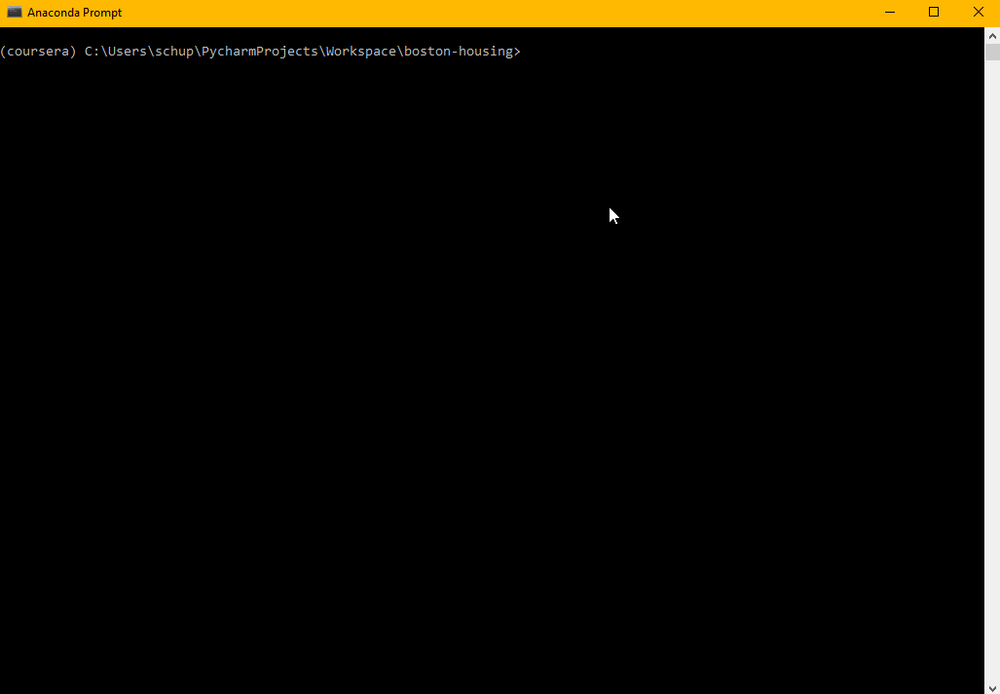

# Boston Housing Prediction
> Predict Housing prices in boston with different Models.   
  
[](LICENSE)
[](https://www.codacy.com/manual/LuposX/BostonHousingPrediction?utm_source=github.com&amp;utm_medium=referral&amp;utm_content=LuposX/BostonHousingPrediction&amp;utm_campaign=Badge_Grade)

Boston Housing Prediction is a python script that can predict the housing prices in boston with different models, the user can choose from.  



## Installation

Windows:

```sh
$ pip install -r requirements.txt
```
Download `boston_hosuing_pred.py`.

## Usage example

A few motivating and useful examples of how your product can be used. Spice this up with code blocks and potentially more screenshots.

_For more examples and usage, please refer to the [Wiki][wiki]._

## Release History

* 0.1.0
    * The first proper release
    * Realese of readme (Thanks @dbader)
* 0.0.1
    * Work in progress

## Meta

<!--Your Name – [@YourTwitter](https://twitter.com/dbader_org) – YourEmail@example.com-->

Distributed under the MIT license. See ``LICENSE`` for more information.

[https://github.com/LuposX](https://github.com/LuposX)

## Contributing

1. Fork it (<https://github.com/LuposX/BostonHousingPrediction/fork>)
2. Create your feature branch (`git checkout -b feature/fooBar`)
3. Commit your changes (`git commit -am 'Add some fooBar'`)
4. Push to the branch (`git push origin feature/fooBar`)
5. Create a new Pull Request

<!-- Markdown link & img dfn's -->
[npm-image]: https://img.shields.io/npm/v/datadog-metrics.svg?style=flat-square
[npm-url]: https://npmjs.org/package/datadog-metrics
[npm-downloads]: https://img.shields.io/npm/dm/datadog-metrics.svg?style=flat-square
[travis-image]: https://img.shields.io/travis/dbader/node-datadog-metrics/master.svg?style=flat-square
[travis-url]: https://travis-ci.org/dbader/node-datadog-metrics
[wiki]: https://github.com/yourname/yourproject/wiki
